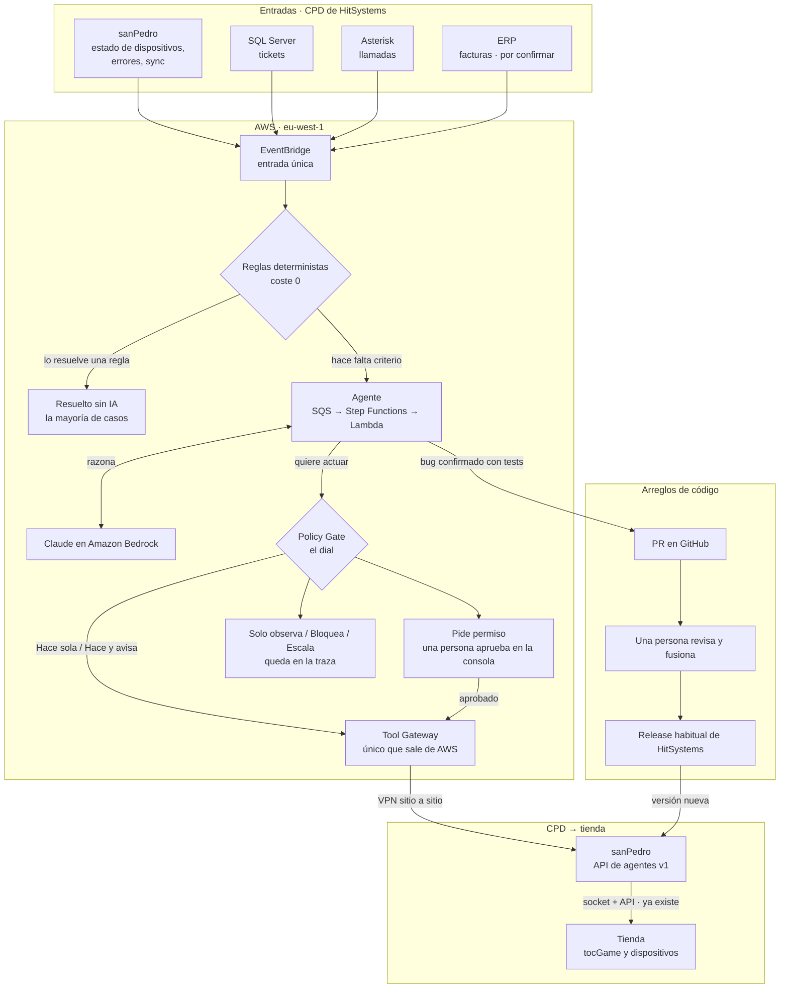
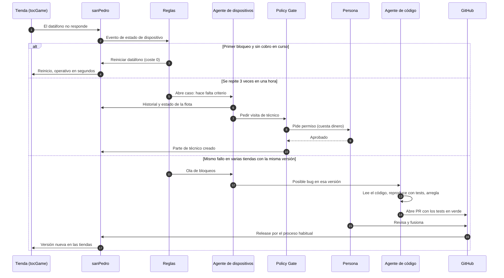
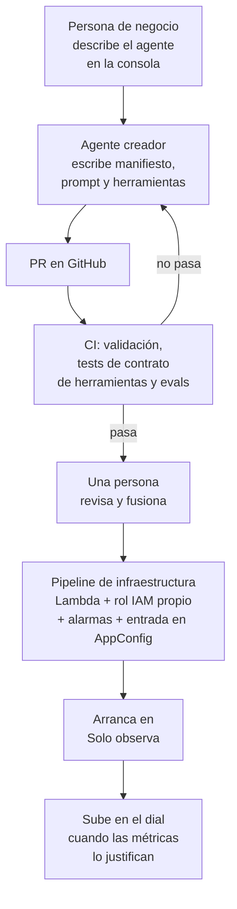
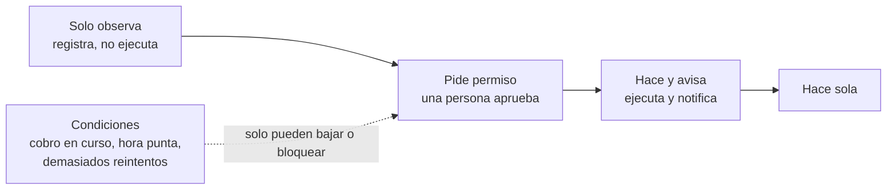

# Cómo funcionaría en producción

La demo corre entera en un portátil. En producción son las mismas piezas (reglas, agentes, dial,
aprobaciones, trazas) repartidas en tres zonas con dueños distintos: **AWS** orquesta y razona,
el **CPD de HitSystems** sigue siendo la fuente de verdad y la **tienda** vende sin depender de AWS.

## 1. Flujo general

**Cómo leerlo.** Todo entra por un único sitio (EventBridge), y cada paso queda en la traza del caso
con su coste. Las reglas absorben el volumen
con coste 0: reiniciar un datáfono bloqueado no necesita IA. Solo lo que requiere criterio pasa a
un agente, y cada acción del agente pasa por el Policy Gate, que decide según el dial si la hace
sola, la hace y avisa, pide permiso, solo la registra o la bloquea. Los agentes no tocan la red: todo sale
por el Tool Gateway, por VPN, hacia la API de agentes de sanPedro, que ya habla con cada tienda.

## 2. Ejemplo: un datáfono bloqueado

## 3. Añadir un agente nuevo

Añadir un agente no toca el runtime: es una carpeta en `agents/`, sus herramientas y una entrada
en la infraestructura. En la demo el agente se carga en caliente al fusionar; en producción se
despliega como su propia Lambda, con su rol, su presupuesto y su límite de concurrencia, para que
un agente desbocado no deje sin capacidad a los demás.

## 4. El dial de autonomía

Cada acción tiene un techo por defecto, que se puede ajustar por cliente o por tienda (por
ejemplo, 365 en «Pide permiso» mientras el resto va en «Hace sola»). Se cambia en caliente, sin
desplegar. Las condiciones solo pueden bajar ese techo o bloquear, nunca subirlo.

## 5. De la demo a producción

| En la demo | En producción |
|---|---|
| Servidor Node en un portátil | Lambda + Step Functions en eu-west-1 |
| API de Claude directa | Claude en Amazon Bedrock, con los datos en la UE |
| Eventos en memoria | EventBridge + SQS |
| `config/policies.yaml` | AppConfig: el dial se cambia en caliente |
| `data/state.json` | Base de datos gestionada para casos y trazas |
| Simulador de dispositivos | sanPedro, por su API de agentes v1 y VPN |
| Tickets de ejemplo | SQL Server de ticketing, a través del Tool Gateway |
| Carpeta `terminal-pagos/` | Repositorios reales de tocGame y sanPedro |
| Fusión detectada por sondeo | Webhook de GitHub + CI/CD con evals |
| Consola local | La misma consola, con acceso por usuario y rol |

## 6. Reglas que no cambian

- **Una panadería tiene que poder vender aunque AWS esté caído.** Nada de esto entra en el
  arranque ni en el camino de venta de tocGame.
- **Nada de alto volumen pasa por el modelo.** Primero reglas; la IA, solo para lo que queda.
- **Ningún agente fusiona ni despliega.** Abre PRs; fusiona una persona.
- **Toda acción pasa por el dial**, con el ámbito cliente → tienda → dispositivo en cada caso,
  política, presupuesto y traza.
- **Presupuesto por caso, por agente y por día**, con corte automático.

Pendiente de confirmar para cerrar el detalle: el ERP de facturación, el volumen mensual de casos
y si ya existe cuenta de AWS.
